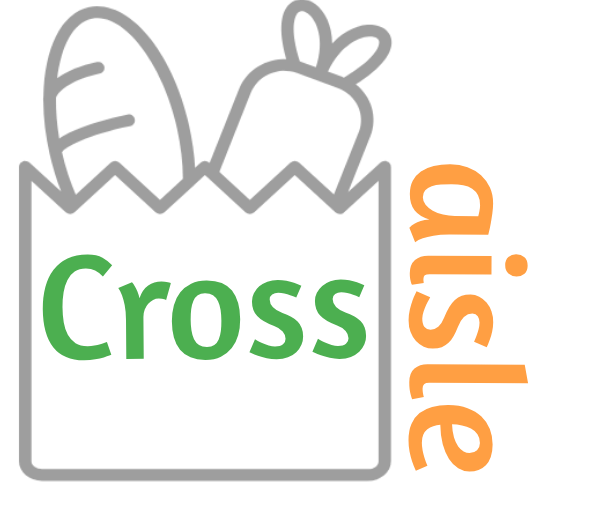

<a href="http://localhost:3000/"></a>

# Cross Aisle Website

An ecommerce website where customers can order deliveries of groceries from varieties for stores in Calgary.

## Getting Started

Clone the git repository into you local machine. <br />
In both <b>./client </b> and <b>./server </b> directories, run

```
$ npm install
```

from your terminal.

Need to run migrations and seedings starting the front-end and back-end servers.
In PostgresQL create username <b>labber</b> and its password as <b>labber</b>; also create database <b>grocery_app</b>.
In <b>./server </b> directory, run

```
$ knex migrate:latest
```

followed by

```
$ knex seed:run
```

from your terminal. Then go to PostgresQL and connect to database grocery_app by running

```
# \c grocery_app;
```

followed by

```
# COPY products(name,description,price,department_id,category_id,brand_id,store_id,image)
FROM '/Users/ravindrarawat/lighthouse/LIGHTHOUSE-BOOTCAMP/grocery_app/server/db/products3.csv' DELIMITER '|' CSV HEADER;
```

Now the database is set!

To start the servers, in both of the directories run

```
$ npm start
```
Note: The front-end server need the the data from the back-end on npm start; so start the back-end server first;
## Project Structure

├── client # front-end React server \
├── server # back-end server\
└── README.md